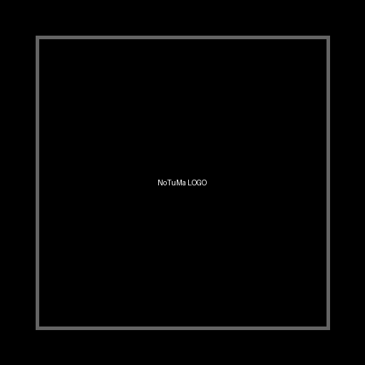
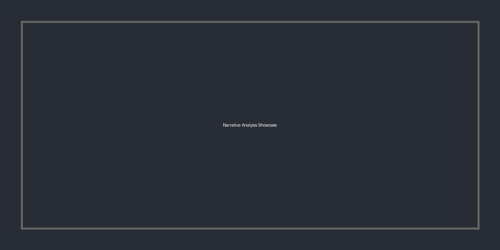
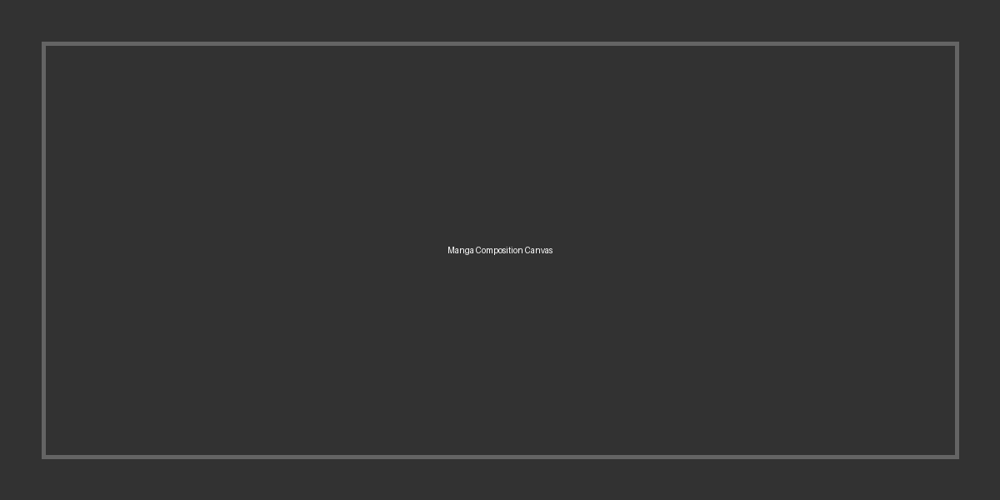
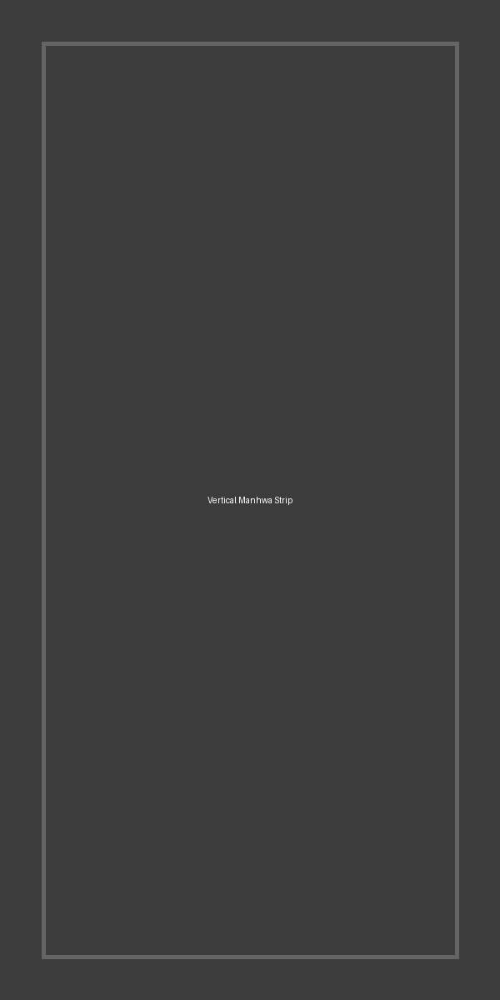
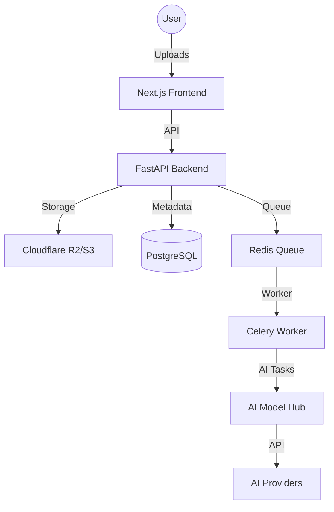

#  NoTuMa: Novel To Manga Converter

[](https://opensource.org/licenses/MIT)
[](https://nextjs.org/)
[](https://fastapi.tiangolo.com/)
[](https://www.postgresql.org/)
[](https://www.docker.com/)

**NoTuMa** is a professional-grade AI-powered platform that transforms literary novels into high-fidelity manga and manhwa. By leveraging state-of-the-art NLP and generative AI, NoTuMa automates the complex pipeline of narrative analysis, character consistency, and visual composition.

---

## ✨ Key Features

### 🚀 Advanced Ingestion & Analysis

- **Format Support**: Seamlessly ingest EPUB, DOCX, and TXT files.
- **Narrative Intelligence**: Automated extraction of chapters, scenes, and character profiles using LLM-driven analysis.
- **Dialogue Mapping**: Precise association of dialogue to characters and specific narrative beats.

### 🎨 Intelligent Image Generation (Model Hub)
- **Multi-Provider Support**: Integrated with Pollinations, Stability AI, OpenAI, and Replicate.
- **Specialized Models**: Native support for **NanoBanana** for high-fidelity manga aesthetics.
- **Style Extraction**: Ingest a MangaDex URL to automatically extract and apply visual styles (line weight, color palette, screentones).
- **Visual Consistency**: LoRA and IP-Adapter integration for persistent character appearance across panels.

### 🖌️ Professional Composition Engine

- **Interactive Canvas**: High-performance editor built with Fabric.js for fluid panel arrangement and bubble placement.
- **Manga Aesthetics**: Native support for diagonal panels, overlapping elements, and professional manga textures.
- **Manhwa Ready**:  specialized support for long-strip vertical layouts with seamless narrative flow.

### 📦 Production-Ready Export
- **High Resolution**: Export in crystal-clear PNG and JPEG formats.
- **E-Reader Optimized**: Generate CBZ, PDF, and Fixed-Layout EPUB files ready for any device.

---

## 🏗️ System Architecture

NoTuMa uses a distributed architecture designed for scalability and high-performance AI processing.



---

## 🛠️ Tech Stack

- **Frontend**: Next.js 15 (App Router), Tailwind CSS, Fabric.js, Lucide React, Auth.js.
- **Backend**: FastAPI, Celery, SQLAlchemy/Prisma, Pydantic.
- **Infrastructure**: PostgreSQL 16, Redis 7, Docker Compose, Sentry monitoring.
- **AI/ML**: Pollinations.ai, Stability AI, OpenAI, Replicate, custom NLP pipelines.

---

## 🚦 Quick Start

### Prerequisites
- Docker & Docker Compose
- S3-compatible storage (optional, defaults to local simulation)
- API keys for AI providers (optional, Pollinations used by default)

### Setup
1. **Clone the repository**:
   ```bash
   git clone https://github.com/your-org/notuma.git
   cd notuma
   ```

2. **Configure Environment**:
   ```bash
   cp .env.example .env
   # Edit .env with your configuration
   ```

3. **Launch with Docker**:
   ```bash
   docker-compose up --build
   ```

4. **Access the Application**:
   - Frontend: `http://localhost:3000`
   - Backend API: `http://localhost:8000/docs`

---

## 📂 Documentation

For deep dives into the system architecture and implementation details, see the `docs/` directory:
- [System Overview](docs/architecture/system_overview.md)
- [API Specification](docs/architecture/api_specification.md)
- [Data Model](docs/architecture/data_model.md)
- [Technical Deep Dives](docs/architecture/technical_deep_dives.md)

---

## 📜 License
Distributed under the MIT License. See `LICENSE` for more information.
