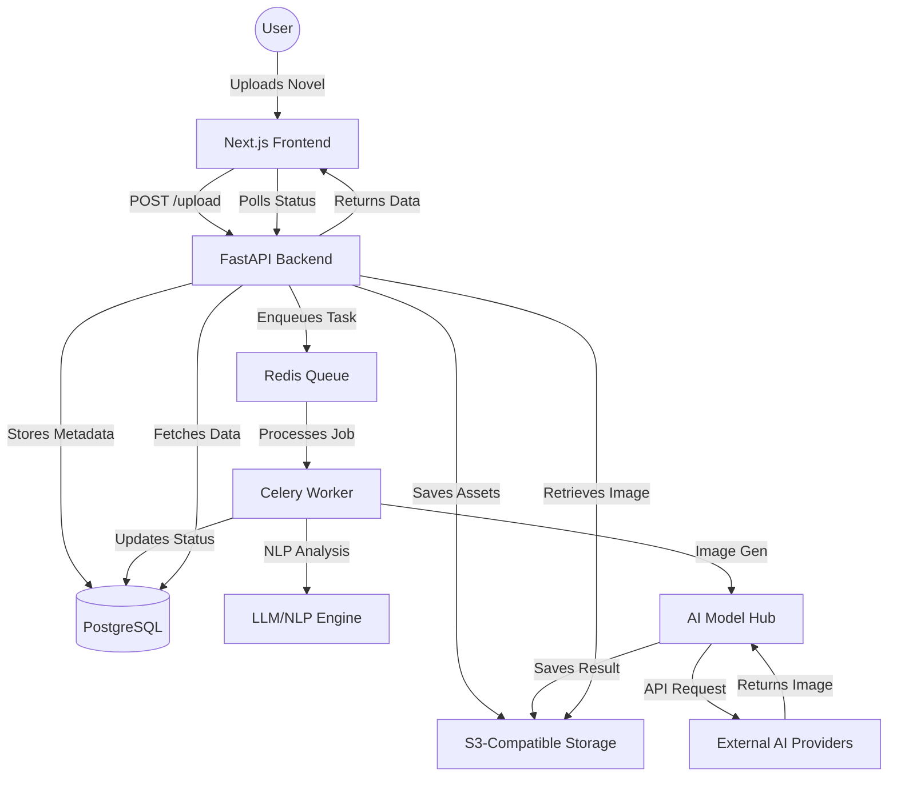

# System Overview

NoTuMa (Novel To Manga) is designed as a distributed, high-performance system for transforming literary works into visual manga and manhwa. The architecture prioritizes scalability, modularity, and a professional-grade user experience.

## High-Level Architecture

The system is composed of several key components:

1.  **Frontend (Next.js/React):** A responsive web application built with Next.js (App Router), Tailwind CSS, and Lucide React. It provides the interactive canvas for manga composition, project management, and a narrative editor.
2.  **Backend (FastAPI):** A high-performance Python-based API server that handles business logic, narrative analysis, and orchestrates the AI image generation workflow.
3.  **Database (PostgreSQL):** A relational database for persisting user projects, chapters, scenes, character profiles, and metadata.
4.  **Task Queue (Celery + Redis):** A distributed task queue for asynchronous processing of long-running tasks, primarily AI image generation and complex NLP analysis.
5.  **Storage (Cloudflare R2/AWS S3):** Scalable object storage for uploaded novels, generated images, and final manga exports.

## Component Interaction

The following Mermaid diagram illustrates the flow of data through the system:

## Core Workflow

1.  **Ingestion:** The user uploads a novel in various formats (EPUB, DOCX, TXT). The system parses and segments the text into chapters and scenes.
2.  **Narrative Analysis:** The system uses NLP and LLMs to extract characters, physical traits, relationships, and dialogue mapping.
3.  **Character Management:** Users can define and persist character profiles (physical descriptions, visual references) to ensure consistency.
4.  **Image Generation:** The "Model Hub" handles requests to various AI providers, using prompt engineering and techniques like LoRAs/IP-Adapter for consistent art styles.
5.  **Composition:** Users use an interactive canvas to arrange generated panels, add speech bubbles, and apply manga-style effects (screentones, speed lines).
6.  **Export:** The system generates high-resolution outputs in formats like PNG, PDF, CBZ, and Fixed-Layout EPUB.
